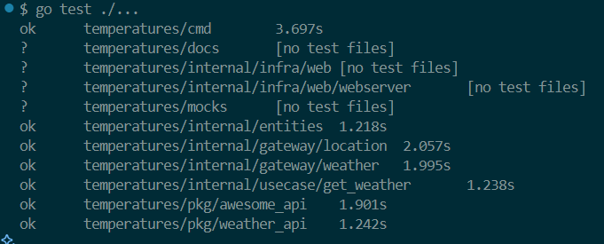

# 📦 Weather by ZipCode - Desafio em Go

Este projeto consiste em um sistema desenvolvido em Go que recebe um **CEP (Código de Endereçamento Postal - Brasil)** ou uma coordenada no formato **latitude,longitude** e identifica a **cidade** correspondente e retorna o **clima atual**, exibindo a temperatura nas seguintes unidades: **Celsius, Fahrenheit e Kelvin**.

O sistema foi implementado com foco em simplicidade, boas práticas e deploy escalável via **Google Cloud Run**.

---

## 🚀 Funcionalidades

- Consulta da cidade através do **CEP (via [AwesomeAPI](https://docs.awesomeapi.com.br/api-cep))**
- Consulta da temperatura atual com base na cidade (via [WeatherAPI](https://www.weatherapi.com/))
- Conversão automática das temperaturas:
  - Celsius
  - Fahrenheit
  - Kelvin
- API REST com respostas padronizadas
- Documentação em Swagger
- Deploy em **Google Cloud Run**
- Testes automatizados
- Ambiente preparado via **Docker/Docker Compose**

---

## 📥 Como usar

### 1. Clonar o projeto
```bash
git clone https://github.com/LuisGaravaso/goexpert-temperature-lab1.git
cd goexpert-temperature-lab1
```

### 2. Configurar variáveis de ambiente
Para utilizar a API da WeatherAPI, você precisa configurar um arquivo `.env` com a chave da **WeatherAPI**:
Coloque-o dentro da pasta `./pkg/weather_api` e ele será lido pelo arquivo `./pkg/weather_api/configs.go`

```dotenv
WEATHER_API_KEY=your_weather_api_key_here
```

### 3. Rode os testes
```bash
go test ./...
``` 

Você deve ver tudo passando, conforme imagem abaixo:




### 4. Executando
#### 4.1 Rodando no Terminal
```bash
cd cmd && go run main.go
```

O serviço estará disponível em: `http://localhost:8080/temperature/01001010`

#### 4.2 Rodando com Docker
```bash
docker build -t myweatherapi .
docker run -p 8080:8080 myweatherapi
```

O serviço estará disponível em: `http://localhost:8080/temperature/01001010`

---

## Documentação da API

Esse projeto vem com Swagger.
Para acessá-lo, entre em http://localhost:8080/swagger/index.html

## 📡 Endpoint da API

### `GET /temperature/{location}`

#### ✅ Exemplo de sucesso:
```http
GET /weather/01001000
```

**Response:**
```json
{
  "coordinates": "-23.5514794,-46.6332722",
  "city": "Sao Paulo",
  "region": "Sao Paulo",
  "country": "Brazil",
  "temp_C": 25.3,
  "temp_F": 77.54,
  "temp_K": 298.45,
  "pressure_in_millibars": 1016,
  "precipitation_in_millimeters": 0,
  "humidity_in_percentage": 83,
  "wind_in_kph": 7.6,
  "wind_direction": "NNW"
}
```

**HTTP Status:** `200 OK`

---

#### ❌ Exemplo de erro: CEP inválido (formato incorreto)
```http
GET /weather/123
```
**HTTP Status:** `422 Unprocessable Entity`  
**Response:**
```json
{ "message": "invalid location" }
```

---

#### ❌ Exemplo de erro: CEP não encontrado
```http
GET /weather/99999999
```
**HTTP Status:** `404 Not Found`  
**Response:**
```json
{ "message": "location not found" }
```

---

## 🧪 Testes Automatizados

O projeto conta com uma suíte de **testes automatizados organizados por camadas**, garantindo a qualidade e a confiabilidade da aplicação em diferentes níveis:

### ✅ Tipos de Testes

- **Testes de Unidade**
  - Validação isolada da lógica de componentes específicos da aplicação.
  - Exemplos:
    - `internal/entities/location_test.go`: Testa a entidade de localização.
    - `pkg/awesome_api/awesome_api_test.go`: Testa o client da AwesomeAPI.
    - `pkg/weather_api/weather_api_test.go`: Testa o client da WeatherAPI.

- **Testes de Integração**
  - Validam a interação entre componentes internos e serviços externos simulados com mocks.
  - Exemplos:
    - `internal/usecase/get_weather/get_weather_test.go`: Testa o fluxo completo do caso de uso "Obter clima", utilizando mocks das interfaces externas.
    - `internal/gateway/location/awesome_cep2coordinates_test.go`: Testa se o Gateway da AwesomeAPI implementa corretamente a interface de Location
    - `internal/gateway/weather/weather_by_coordinates_test.go`: Testa se o Gateway da AwesomeAPI implementa corretamente a interface de Weather

- **Testes End-to-End (E2E)**
  - Simulam o comportamento do usuário final ao consumir o endpoint da API.
  - Exemplo:
    - `cmd/main_test.go`: Testa o fluxo completo da aplicação, incluindo inicialização do servidor, chamadas HTTP e verificação de respostas esperadas.

---

### 🔄 Mocks

Para facilitar os testes de integração e isolamento, o projeto conta com implementações de **mocks das interfaces externas**:
- `mocks/location_gateway_mock.go`
- `mocks/weather_gateway_mock.go`

Esses mocks possibilitam simular respostas da ViaCEP/AwesomeAPI e WeatherAPI, permitindo testes confiáveis mesmo sem conexão externa.

---

### ▶️ Como executar os testes

Execute os testes com o seguinte comando:

```bash
go test ./...
```

---

## ☁️ Deploy no Google Cloud Run

Este projeto foi publicado no **Google Cloud Run** e está disponível no seguinte endereço:

👉 [https://goexpert-temperature-lab-ieusf5ioka-uc.a.run.app](https://goexpert-temperature-lab-ieusf5ioka-uc.a.run.app/temperature/01001010)

---

## 🔧 Tecnologias Utilizadas

- Golang
- Docker
- Google Cloud Run
- Awesome API
- WeatherAPI
- Testes com `testing` package

---

## 📂 Estrutura do Projeto

```
root/
├── cmd/                                 # Ponto de entrada da aplicação
│   ├── main.go                             # Inicializa e executa o servidor da aplicação
│   └── main_test.go                        # Testes E2E da Aplicação para cumprir os requisitos do projeto
├── docs/                                # Documentação da API com Swagger
├── internal/                            # Lógica interna da aplicação (domínio e regras de negócio)
│   ├── entities/                           # Definições das entidades de domínio
│   │   ├── location.go                         # Entidade de localização (cidade, estado, etc.)
│   │   └── location_test.go                    # Testes de unidade da entidade de localização
│   ├── gateway/                         # Interfaces de comunicação externa (abstrações)
│   │   ├── location/                       # Interface para serviço de busca de localização (ex: ViaCEP, AwesomeAPI)
│   │   └── weather/                        # Interface para serviço de clima (ex: WeatherAPI)
│   ├── infra/                           # Implementações das interfaces/gateways
│   │   └── web/                            # Implementações web/HTTP
│   │       └── webserver/                      # Manipuladores HTTP da aplicação
│   │       └── weather_handler.go              # Handler principal para receber CEP e retornar temperaturas
│   └── usecase/                         # Casos de uso (regras de negócio da aplicação)
│       └── get_weather/                    # Caso de uso: Obter o clima a partir de uma Localidade (CEP ou Coordenada)
│           ├── dtos.go                         # Objetos de transferência de dados usados no usecase
│           ├── get_weather.go                  # Implementação da lógica principal do caso de uso
│           └── get_weather_test.go             # Testes de integração para o caso de uso
├── mocks/                               # Mocks para facilitar testes
│   ├── location_gateway_mock.go            # Mock da interface do serviço de localização
│   └── weather_gateway_mock.go             # Mock da interface do serviço de clima
├── pkg/                                 # Pacotes reutilizáveis e específicos de integração
│   ├── awesome_api/                        # Integração com a AwesomeAPI para buscar CEPs
│   │   ├── awesome_api.go                      # Implementação do client da API externa
│   │   └── awesome_api_test.go                 # Testes de unidade da AwesomeAPI
│   └── weather_api/                        # Integração com o serviço de clima (WeatherAPI)
│       ├── .env                                # Arquivo de variáveis de ambiente (ex: chave da WeatherAPI)
│       ├── configs.go                          # Configuração e leitura de variáveis de ambiente
│       ├── weather_api.go                      # Implementação do client da WeatherAPI
│       └── weather_api_test.go                 # Testes de unidade da WeatherAPI
```
